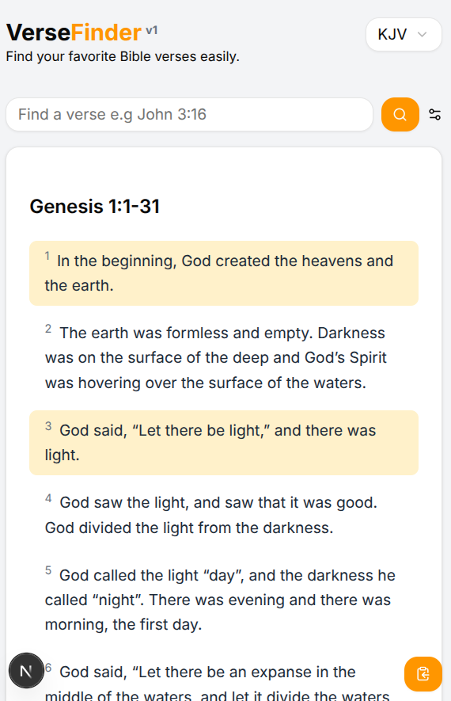

# 📖 VerseFinder

**VerseFinder** is a clean and intuitive Bible verse lookup tool built with Next.js and Tailwind CSS. It uses the [Bible API](https://bible-api.com) to allow users to search for specific verses, select Bible versions, and copy verses easily.

## 📖 Screenshot



## 🚀 Features

- 🔍 Search for Bible verses by reference (e.g., `John 3:16`)
- 📚 Select from multiple Bible versions (KJV, ASV, WEB, BBE)
- 📋 Copy verses to clipboard with one click
- ✅ Toast notifications for feedback
- 🎨 Clean, minimal UI using Tailwind CSS and shadcn/ui components

## 🛠️ Tech Stack

- [Next.js](https://nextjs.org/)
- [Tailwind CSS](https://tailwindcss.com/)
- [Shadcn/UI](https://ui.shadcn.com/)
- [Framer Motion](https://www.framer.com/motion/)
- [Sonner](https://sonner.emilkowal.ski/) (for toast notifications)
- [Bible API](https://bible-api.com) (for verse data)

## 📦 Installation

```bash
# Clone the repo
git clone https://github.com/CJTS15/versefinder.git
cd versefinder

# Install dependencies
npm install

# Start the development server
npm run dev
```

## 📄 Usage

1. Select a Bible version.
2. Enter a verse reference in the input (e.g., Genesis 1:1).
3. Click "Search" to view the verse.
4. Click the "Copy" icon to copy the verse to your clipboard.

